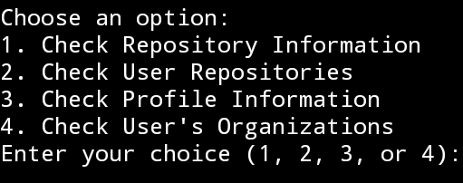

# GithubStatsChecker

> An automated terminal bot to check GitHub repository and profile information.

## Features

- Check repository information
- List and view user repositories
- Fetch and display profile information
- Retrieve user organizations

## Getting Started

### Prerequisites

- Python 3.x

### Installation

1. Clone the repository:
   `sh
   git clone https://github.com/muhtadshah/GithubStatsChecker.git`
2. Navigate to the project directory:
   `cd GithubStatsChecker`
3. Install the required dependencies:
   `pip install requests`
   
### Usage
1. Run the script:
   `python main.py`
2. Choose an option from menu:
   - Check Repository Information
   - Check User Repositories
   - Check Profile Information
   - Check User's Organizations

### License
Distributed under the GNU General Public License v3.0 License. See `LICENSE` for more info.

### Contributing
Contributions are welcome! Please fork the repository and submit a pull request.

### Contact
muhtadshah7 on Instagram
